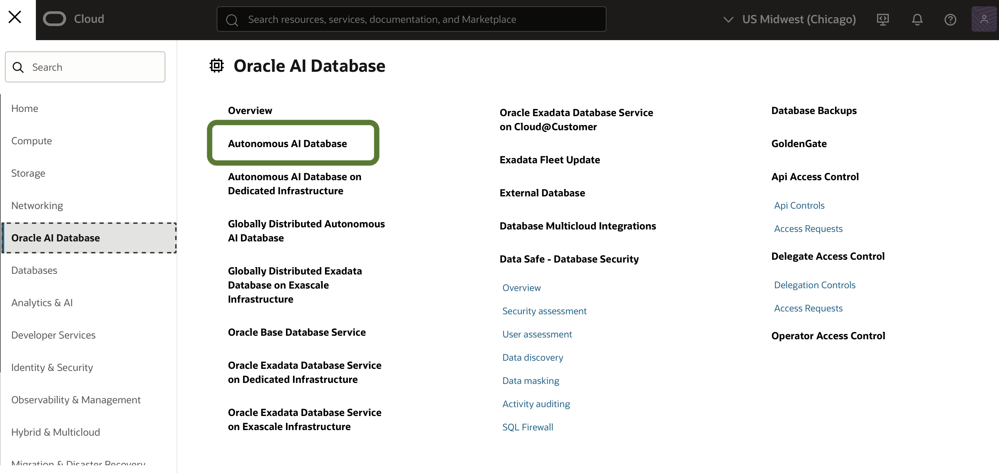
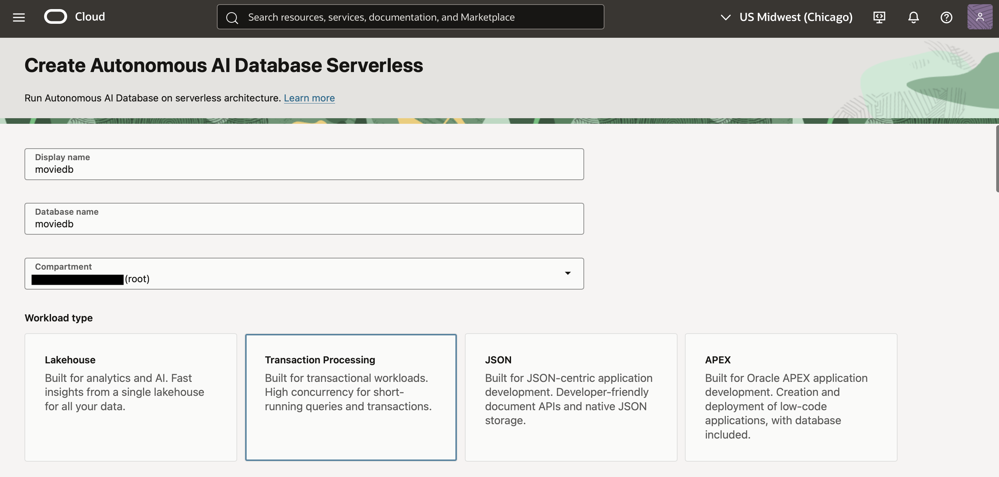
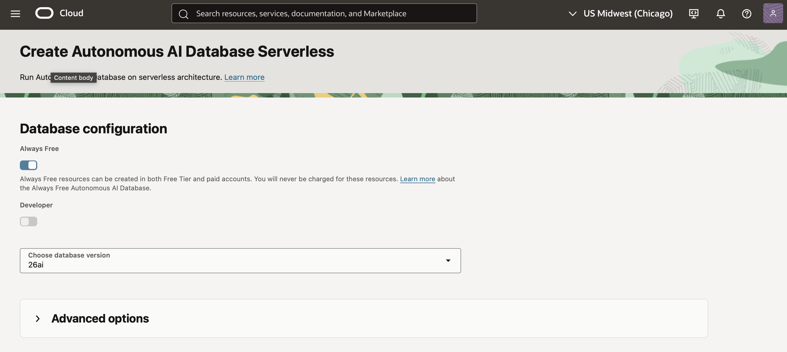
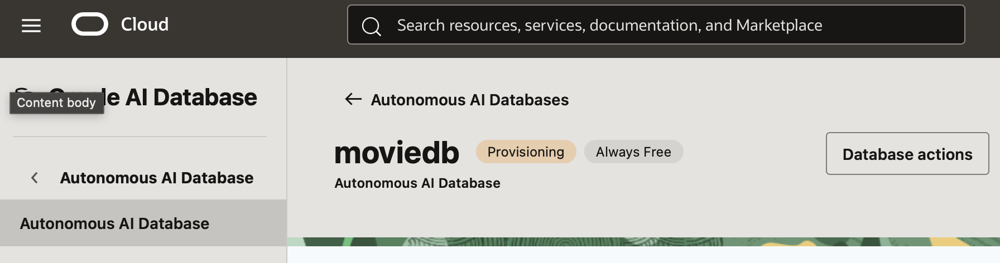
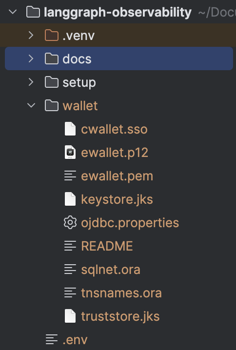

# Oracle Cloud Setup

This guide walks you through creating an Oracle Autonomous Database in Oracle Cloud Infrastructure (OCI).
We'll use the **Always Free** tier, which provides a fully functional database at no cost.

## Step 1: Create an Oracle Cloud Account

1. Navigate to [cloud.oracle.com](https://cloud.oracle.com/)
2. Click **Sign Up** or **Start for Free**
3. Fill in your details:
4. Verify your email
5. Complete account setup

## Step 2: Access the Oracle Cloud Console

1. Sign in to your Oracle Cloud account
2. You'll land on the OCI Console dashboard

## Step 3: Create an Autonomous Database

1. In the search bar at the top, type "Autonomous Database"
2. Click **Autonomous Database** under Services

3. Click **Create Autonomous Database**



4. Configure the database:

   **Display name**: `moviedb` (or your preferred name)

   **Database name**: `moviedb` (same name as display)

   **Workload type**: Select **Transaction Processing**

   **Deployment type**: Select **Serverless**



5. Configure the database version and resources:

   **Always Free**: Toggle **ON**

   **Database version**: 26ai (or latest available)

<!-- TODO: Add screenshot -->


6. Set the administrator credentials:

   **Username**: `ADMIN` (this is fixed)

   **Password**: Create a strong password
   - At least 12 characters
   - At least 1 uppercase letter
   - At least 1 lowercase letter
   - At least 1 number
   - No special characters at the start

   > **Important**: Save this password securely - you'll need it for the `.env` file.

7. Network access configuration:

   **Access type**: Select **Secure access from everywhere**

   This allows connections from your local machine via the wallet.

8. Review and click **Create Autonomous Database**

9. Wait for provisioning (a few minutes). The database status will change from **Provisioning** to **Available**.



## Step 4: Download the Wallet

The wallet contains connection credentials and certificates needed to connect securely.

1. On your Autonomous Database details page, click **Database connection**

2. In the popup, click **Download wallet**

3. Create a wallet password:
   - This is separate from your ADMIN password
   - This should be stored as a project environment variable (see .env.example)

4. Click **Download** and save the ZIP file

## Step 5: Extract and Place the Wallet

1. Create a `wallet` directory in your project, and copy unzipped wallet contents into project wallet folder:
   ```
   mkdir -p /path/to/langgraph-observability/wallet
   ```



## Step 6: Note Your Connection String

1. Open `wallet/tnsnames.ora` in a text editor
2. Find the connection strings - they'll look like:
   ```
   moviedb_high = (description= ...)
   moviedb_medium = (description= ...)
   moviedb_low = (description= ...)
   ```

3. For this project, use the `_medium` or `_high` connection string as the corresponding environment variable:
   ```
   ORACLE_CONNECTION_STRING=moviedb_medium
   ```

## Environment Variables to Save

After completing this guide, you should have values for:

| Variable | Value | Example |
|----------|-------|---------|
| `ORACLE_USERNAME` | Always `ADMIN` | `ADMIN` |
| `ORACLE_PASSWORD` | Your admin password | `MySecure123` |
| `ORACLE_CONNECTION_STRING` | From tnsnames.ora | `moviedb_high` |
| `ORACLE_WALLET_LOCATION` | Path to wallet directory | `./wallet` |
| `ORACLE_WALLET_PASSWORD` | Wallet download password | `WalletPass456` |

---

**Next**: [Anthropic API Setup](03-anthropic-api-setup.md)
