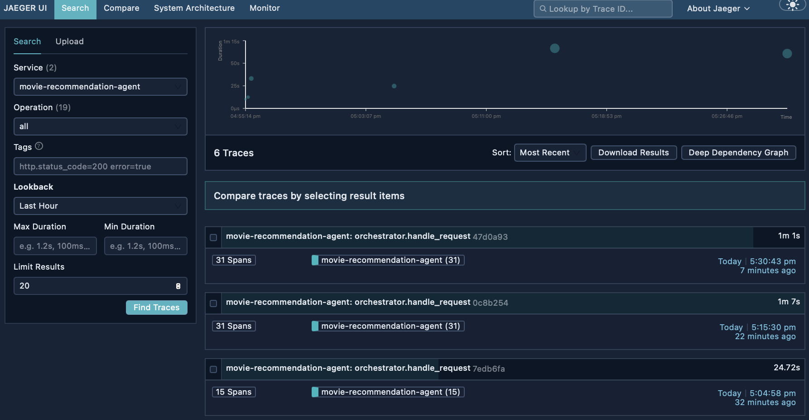

# Jaeger Setup

Jaeger is the distributed tracing platform used to visualize traces from the multi-agent system.
This guide covers running Jaeger locally via Docker.

## What is Jaeger?

**Jaeger** is an open-source distributed tracing system. It helps you:

- **Visualize request flow** across multiple services/agents
- **Identify performance bottlenecks** by seeing timing for each operation
- **Debug errors** by examining the full trace context
- **Understand dependencies** between components

In this project, Jaeger receives traces from OpenTelemetry and displays them in a web UI.

## Prerequisites

- Docker Desktop installed and running (from [01-prerequisites.md](01-prerequisites.md))

## Step 1: Run Jaeger with Docker

The simplest way to run Jaeger is the "jaeger" latest Docker image:

```bash
docker run -d --name jaeger -p 16686:16686 -p 4317:4317 -p 4318:4318 jaegertracing/jaeger:latest
```

**Port mappings:**

| Port | Purpose |
|------|---------|
| 16686 | Jaeger UI (web interface) |
| 4317 | OpenTelemetry collector (OTLP gRPC) |
| 4318 | OpenTelemetry collector (OTLP HTTP) |

> **Note**: These ports must match the defaults in `shared/config.py` (`TelemetrySettings`). If you change the ports here, update the corresponding values in that class.

## Step 2: Verify Jaeger is Running

1. Check the container is running:
   ```bash
   docker ps
   ```

   You should see `jaeger` in the list with status `Up`.


2. Open the Jaeger UI in your browser:
   ```
   http://localhost:16686
   ```

You should see the Jaeger search interface.



---

**Next**: [Project Installation](06-project-installation.md)
