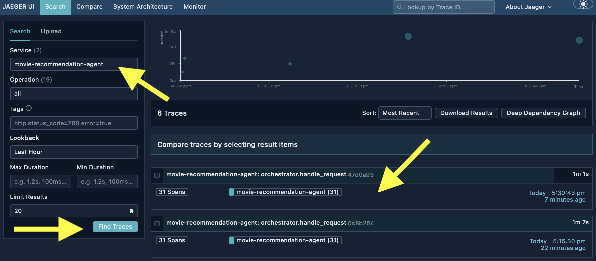
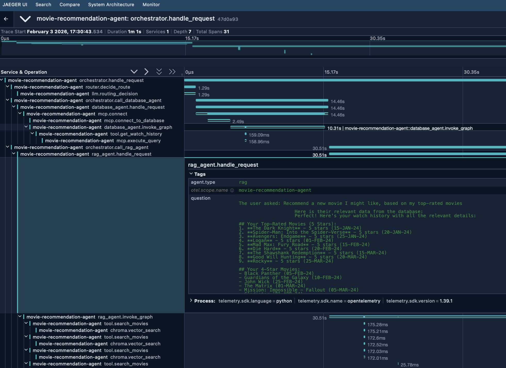

# Running the Demo

This guide covers running the multi-agent system and seeing it in action.

## Prerequisites

Before running:
- [ ] All setup steps completed (database, vector store)
- [ ] Jaeger is running (`docker ps` shows jaeger container)
- [ ] Virtual environment is activated
- [ ] `.env` file is configured

## Step 1: Start Jaeger (if not running)

```bash
docker start jaeger
```

Verify Jaeger is accessible at: http://localhost:16686

## Step 2: Run the Orchestrator

```bash
python agents/orchestrator.py
```

This runs three test queries that demonstrate different routing scenarios.

## Understanding the Three Query Types

Query 1: RAG Only (Tell me about Inception)

Query 2: Database Only (What superhero movies have I seen?)

Query 3: Both (Recommend a new movie I might like)

## Step 3: View Traces in Jaeger

1. Open http://localhost:16686
2. Select **Service**: `movie-recommendation-agent`
3. Click **Find Traces**
4. Click on a trace to see the span hierarchy

You should see traces for each query, showing:
- Total duration
- Individual span timings
- Attributes (question, route decision, etc)

**Look for recent traces by selecting the relevant service, find traces, and selecting the trace.**



After trace selection, you will be able to inspect the trace further (see image below)



Please see accompanying blog post for further details on trace investigation.

## Sample Queries to Try

### RAG-focused queries:
- "Tell me about The Matrix"
- "What movies are similar to Inception?"
- "Find me a comedy about friendship"

### Database-focused queries:
- "What movies have I watched?"
- "What are my highest-rated movies?"
- "Did I watch The Dark Knight?"

### Combined queries (most interesting for observability):
- "Recommend something I haven't seen"
- "What action movies should I watch next?"
- "Find me a drama I might like"
